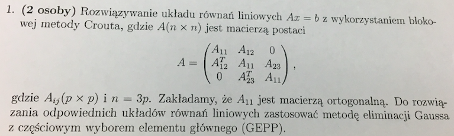

## zadanie

## Co zostało juz zrobione?
1. Wstępny algorytm podziału $A=L*U$\
2. GEPP:\
a) `GEPPp`, czyli $A*x=b$\
b) `GEPPM`, czyli $A*X=M$(poza rozwiazaniem $U*X = M\_nowa$)\
c) `blok3`, czyli $L*x=b$, gdzie $L$ - blokowa specyficzna\
3. `losoweA` generujacy macierze z zadania\

## Co jest do zrobienia w najblizszym czasie?
1. Sprawdziec, czy moge w `blok3` zalozyc, ze $L11$ jest ortogonalna.\
2. Przeczytac notatki zapisane w pliku `CroutPartition.m` i zobaczyc, czy jest tam cos wartosciowego.\
3. $U*X = M\_nowa$ w `GEPPM`.\

## Co jest do zrobienia?
0) Zastanowic sie jakie sa glebsze konsekwencje tego, ze $A_{11}$ jest ortogonalne.\
1) Testy błędów względnych, wspolczynników stabilnosci oraz wspolczynnika poprawnosci.\
2) Porownanie czasu dzialania algorytmu ze standardowym matlabowym $A \backslash b$:\
a) sprawdzenie, jak dziala `tic toc`, czy mozna dodawac wartosci?\
3) Znalezienie za pomocą generatora ciekawych macierzy(pewnie `hilb`, czy cos)\
4) Opisanie dzialania algorytmu w $LaTeX$.\
5) Wykresy:
a) predkosci naszego algorytmu-porowananie z $A \backslash b$.\
`NOTE`: Byc moze `losoweA` jest wystarczajaco stabilne czasowo dla stalych $n$, zeby kozystac z niego w petli i wykonywac obliczenia na bieraco. Trzeba to sprawdzic. Jesli czasem zajmuje mu zrobienie macierzy $9999$ $4$ sekundy, a czasem $7$, to nie mozna w petli, ale jezeli wariancja jest nieduza, to mozna.\
b) bledy wzgledne

